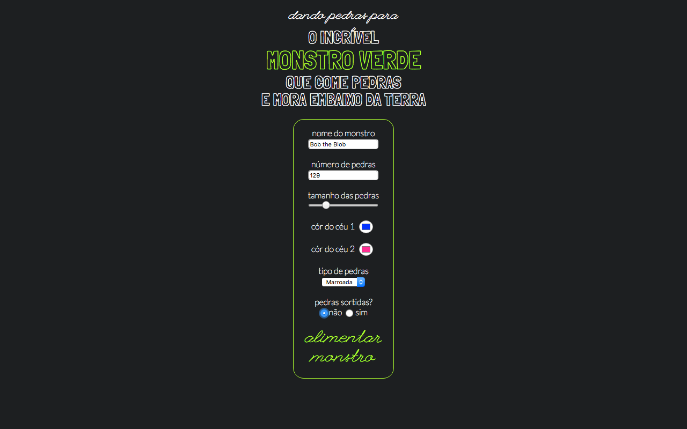
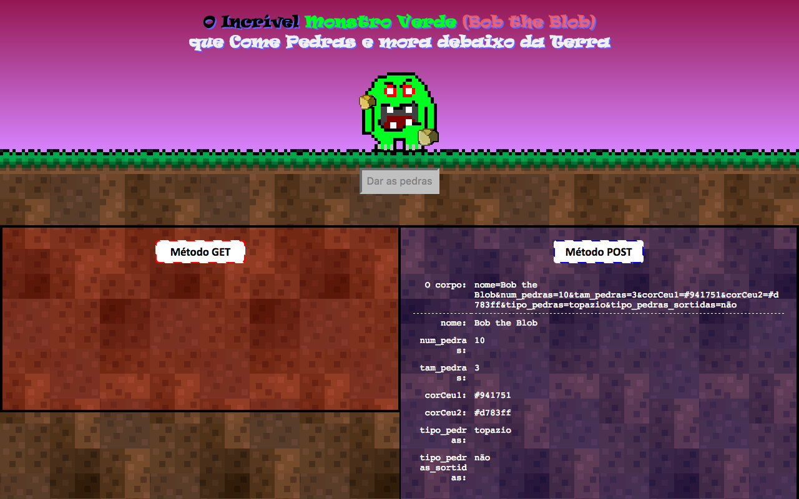

# web-terrivel
Um formulário para dar pedras ao terrível monstro verde que come pedras e mora debaixo da terra

Formulário:

Método GET:

Método POST:

## Créditos
Trabalho realizado por *Pedro Felipe Froes* para a disciplina de Programação Web, ministrada pelo Prof. Flávio Coutinho no CEFET-MG.

Fontes _Lato_, _League Script_ e _Londrina Outline_ do [Google Fonts][source1]

[source1]: https://www.google.com/fonts